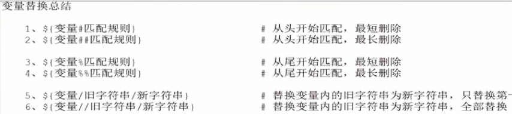

# shell编程中常用的工具

## find命令

**语法格式：find [路径] [选项] [操作]**

**选项**

1、-name：根据文件名查找，例如，查找etc目录下后缀名为conf的文件：`find /etc -name '*.conf'`

-iname：根据文件名查找，忽略文件名大小写

2、-type：按文件类型查找

> &emsp;&emsp;f：文件，`find . -type f`
>
> &emsp;&emsp;d：目录，`find . -type d`
>
> &emsp;&emsp;c：字符设备文件，`find . -type c`
>
> &emsp;&emsp;b：块设备文件，`find . -type b`
>
> &emsp;&emsp;l：链接文件，`find . -type l`
>
> &emsp;&emsp;p：管道文件，`find . -type p`

3、-size -n | +n：按文件大小查找

>&emsp;&emsp;-n：大小小于n的文件，例如：查找/etc目录下小于1000字节的文件：`find /etc -size -1000c`
>
>&emsp;&emsp;+n：大小大于n的文件，例如：查找/etc目录下大于10M的文件：`find /etc -size +10M`
>
>&emsp;&emsp;n：大小等于n的文件（一般找不到，不建议使用）

4、-mtime -n | +n：根据文件更改时间查找（m：modify）

>&emsp;&emsp;-n：n天以内修改的文件，例如：查找/etc目录下5天之内修改且以conf结尾的文件：
>
>&emsp;&emsp;&emsp;&emsp;`find /etc -mtime -5 -name '*.conf'`
>
>&emsp;&emsp;+n：n天以前修改的文件，例如：查找/etc目录下10天之前修改且属主为root的文件：
>
>&emsp;&emsp;&emsp;&emsp;`find /etc -mtime +10 -user root`
>
>&emsp;&emsp;n：正好n天前修改的文件
>
>&emsp;&emsp;-mmin：用法和-mtime一样，time的时间单位为天数，min的时间单位为分钟

-perm：根据文件权限查找

-prune：该选项可以排除某些查找目录

-user：根据文件属主查找 					-nouser：查找无有效属主的文件

-group：根据文件属组查找				  -nogroup：查找无有效属组的文件

-newer file1 ! file2：查找更改时间比file1新但比file2旧的文件

-mindepth n：从n级目录开始搜索

-maxdepth n：最多搜索到n级目录

